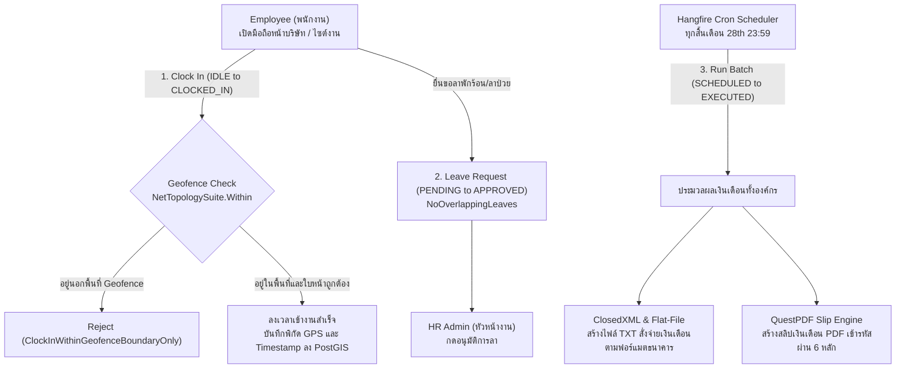
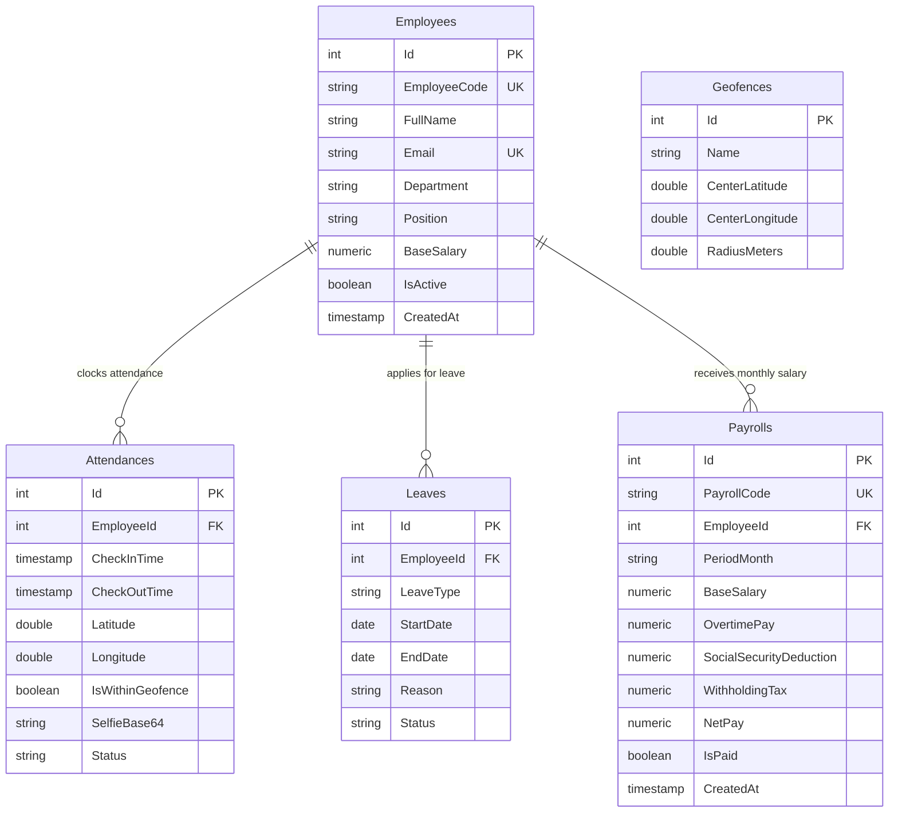

# 03_HRM_PAYROLL_ENGINE: Geofenced Attendance & Automated Payroll

ระบบบริหารทรัพยากรบุคคลและคำนวณเงินเดือนอัตโนมัติ (HRM & Payroll Engine) พร้อมระบบลงเวลาทำงานผ่านการตรวจสอบพิกัด Geofence (Polygon Boundary) ร่วมกับ WebRTC Face Capture, ระบบจัดการวันลาแบบป้องกันวันซ้อนทับ, และการสร้างไฟล์ส่งธนาคารพร้อมสลิปเงินเดือนเข้ารหัส PDF/A

---

## 🔄 ภาพรวม Workflow การทำงาน (Business & Technical Workflow)



### รายละเอียดขั้นตอนการเปลี่ยนสถานะ (State Transitions):
1. **`IDLE ➔ CLOCKED_IN` (Trigger: `CLOCK_IN`)**: พนักงานกดเช็คอิน ระบบดึงพิกัด GPS จากมือถือแล้วนำมาเปรียบเทียบกับขอบเขตพื้นที่บริษัท (Polygon Geofence) ผ่านเอนจิน PostGIS
2. **`PENDING ➔ APPROVED` (Trigger: `APPROVE_LEAVE`)**: ฝ่ายบุคคลอนุมัติใบลา โดยระบบจะตรวจสอบไม่ให้มีวันลาหรือช่วงเวลาที่ซ้ำซ้อนกัน
3. **`SCHEDULED ➔ EXECUTED` (Trigger: `CRON_PAYROLL_RUN`)**: ระบบรันคำนวณเงินเดือนอัตโนมัติ หักขาด ลา มาสาย ประกันสังคม ภาษีหัก ณ ที่จ่าย และออกไฟล์จ่ายเงินเดือนให้ธนาคาร

---

## 🗄️ Database Design & Entity Relationships (PostgreSQL 18 + PostGIS)

### 1. Entity-Relationship Diagram (ER Diagram)



### 2. รายละเอียดตารางและความสัมพันธ์ (Schema & Relationships)
- **`Employees` (ข้อมูลพนักงาน)**:
  - จัดเก็บรหัสพนักงาน (Unique), ชื่อ-นามสกุล, แผนก, ตำแหน่ง, และเงินเดือนฐาน (`BaseSalary`)
  - ความสัมพันธ์: `1 Employee` มีหลาย `Attendances`, `Leaves`, และ `Payrolls`
- **`Geofences` (พิกัดรั้วจำลองเชิงพื้นที่)**:
  - บันทึกจุดกึ่งกลาง (Latitude, Longitude) และรัศมี (RadiusMeters) เพื่อให้ NetTopologySuite และ PostGIS ตรวจสอบ Point-in-Polygon
- **`Attendances` (บันทึกเวลาเข้า-ออกงาน)**:
  - Foreign Key: `EmployeeId` ➔ `Employees(Id)`
  - บันทึกพิกัด GPS, รูปถ่าย Selfie ยืนยันตัวตน, สถานะ (`ON_TIME`, `LATE`, `ABSENT`), และผลการคำนวณ Geofence
- **`Payrolls` (รายการประมวลผลเงินเดือน)**:
  - Foreign Key: `EmployeeId` ➔ `Employees(Id)`
  - บันทึกยอดเงินเดือน, ค่าล่วงเวลา, ยอดหักประกันสังคม (สูงสุด 750 บาท), ภาษีหัก ณ ที่จ่าย, และยอดสุทธิ (`NetPay`)
- **`Leaves` (ประวัติการลา)**:
  - Foreign Key: `EmployeeId` ➔ `Employees(Id)`
  - ตารางนี้ทำงานร่วมกับ Invariant `NoOverlappingLeaves` ป้องกันการลาวันทับซ้อน

---

## 🛡️ กฎเหล็กของระบบ (Domain Invariants)

1. **`ClockInWithinGeofenceBoundaryOnly` (ลงเวลาได้เฉพาะภายในพื้นที่ที่กำหนดเท่านั้น)**:
   - ป้องกันการเช็คอินทิพย์จากที่บ้านหรือนอกสถานที่ โดยใช้การคำนวณแบบ Geospatial Polygon Intersection
2. **`NoOverlappingLeaves` (ห้ามมีวันลาซ้อนทับกัน)**:
   - พนักงานไม่สามารถยื่นขอลาในวันหรือช่วงเวลาที่มีใบลาเดิมที่ได้รับอนุมัติหรือรอพิจารณาอยู่แล้วได้

---

## 💻 Tech Stack & เหตุผลในการเลือกใช้

| ส่วนประกอบ | เทคโนโลยีที่เลือก | เหตุผลที่เลือก | ข้อดีหลัก (Advantages) |
|---|---|---|---|
| **Database** | **PostgreSQL 18 + PostGIS** | รองรับการประมวลผล Spatial Data (พิกัดและเรขาคณิต) | มี Auto-Init Script (`db/init.sql`) พร้อมตาราง Geofence และ Seed Data |
| **Frontend Map** | **Next.js 16 + react-leaflet** | แสดงแผนที่และขอบเขต Geofence ได้อย่างชัดเจนบนอุปกรณ์พกพา | พนักงานเห็นระยะห่างระหว่างจุดที่ยืนอยู่กับรั้วบริษัทได้ทันที |
| **Face Verification**| **WebRTC Face Capture** | ดึงภาพจากกล้องหน้ามือถือแบบสดเพื่อยืนยันตัวตน | ป้องกันการลงเวลาแทนกัน (Buddy Punching) |
| **Geospatial Engine** | **NetTopologySuite + PostGIS** | มาตรฐานการคำนวณพิกัดเชิงภูมิศาสตร์ระดับโลก (OpenGIS) | คำนวณ Point-in-Polygon ได้อย่างแม่นยำระดับเซนติเมตร และประมวลผลเร็วมาก |
| **Cron Scheduler** | **Hangfire (.NET)** | ระบบจัดการ Background Jobs และ Cron ที่มี Dashboard ในตัว | ทำงานต่อเนื่อง มั่นใจได้ว่าเงินเดือนจะถูกประมวลผลตรงเวลาทุกสิ้นเดือนแม้เซิร์ฟเวอร์จะถูกรีสตาร์ต |
| **Bank Export** | **ClosedXML + Flat-File Text** | สร้างไฟล์ Excel สรุปยอดและไฟล์ Text ฟอร์แมตเฉพาะของธนาคาร (SCB, KBank, BBL) | นำไฟล์ส่งให้ธนาคารโอนเงินเข้าบัญชีพนักงานได้ทันทีโดยไม่ต้องคีย์มือ |
| **Encrypted Payslip**| **QuestPDF** | สร้างสลิปเงินเดือนสวยงามพร้อมเข้ารหัสป้องกันการเปิดอ่านด้วยรหัสผ่านส่วนตัว | ปลอดภัย ข้อมูลเงินเดือนไม่รั่วไหลตามมาตรฐาน PDPA |

---

## 🚀 วิธีการรันระบบ (Quick Start)

### ตัวเลือกที่ 1: รันด้วย Docker Compose (แนะนำ)
```bash
docker compose up --build -d
```
> ระบบจะรัน **PostGIS / PostgreSQL 18** (`:5432`), **.NET 10 API** (`:5060`), และ **Next.js 16 Web** (`:3006`) พร้อม Seed ข้อมูลพนักงานและ Geofence ทันที

### ตัวเลือกที่ 2: รันแบบแยก Service (Manual)
1. **รัน Backend API**:
   ```powershell
   cd hrm-api
   dotnet run
   ```
   > API พร้อมทำงานที่: `http://localhost:5060`
2. **รัน Frontend Web**:
   ```powershell
   cd hrm-web
   bun run dev
   ```
   > เข้าใช้งานได้ที่: `http://localhost:3006`
